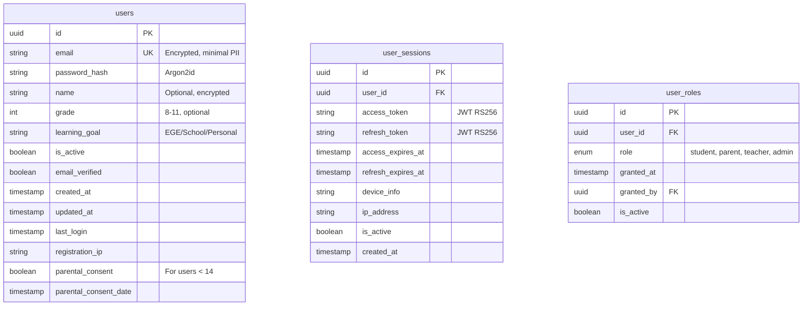
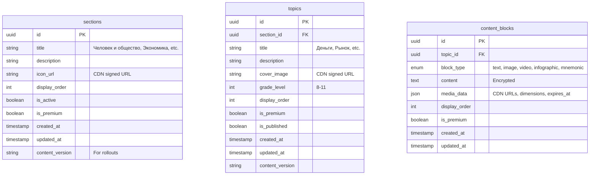
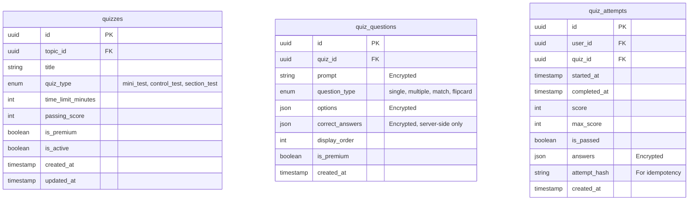
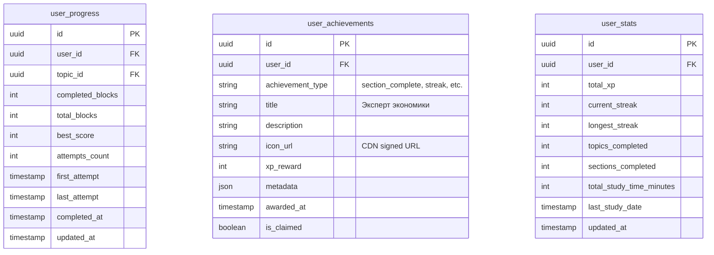
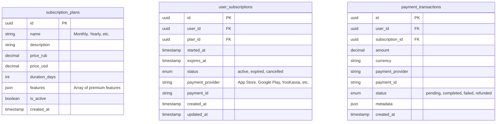
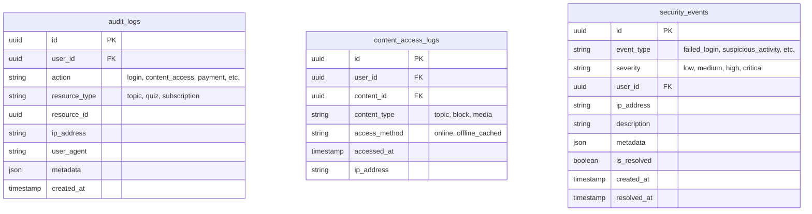
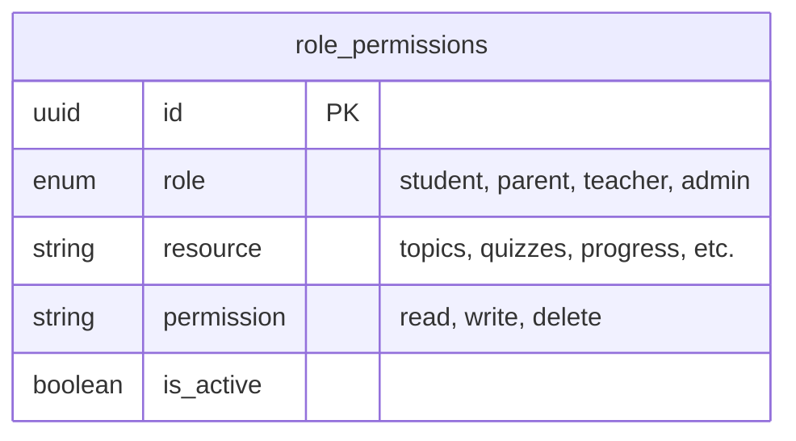
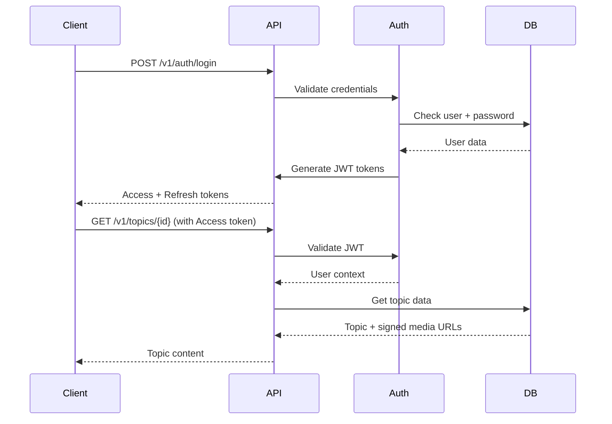
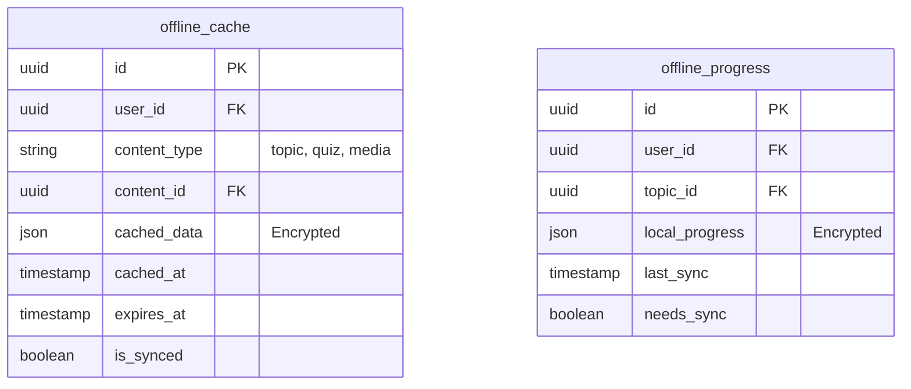

# Database ER-Diagram: Social Studies Educational App

## Overview

This ER-diagram represents the complete database schema for the Russian Social Studies educational mobile application, incorporating security, access controls, and compliance with Russian data protection laws (152-ФЗ).

## Core Tables

### 1. Users & Authentication



### 2. Content Structure



### 3. Assessment & Quizzes



### 4. Progress & Gamification



### 5. Monetization & Subscriptions



### 6. Security & Audit



## Security Implementation

### Data Encryption

- **PII Fields**: All personal data encrypted at rest using AES-256
- **Content**: Educational content encrypted to prevent unauthorized access
- **Passwords**: Argon2id hashing with salt
- **Media URLs**: Signed CDN URLs with expiration (15-60 minutes)

### Access Control



### Compliance Features

- **Parental Consent**: Required for users under 14 (152-ФЗ)
- **Data Retention**: Configurable retention policies
- **Right to Erasure**: Complete data deletion on request
- **Audit Trail**: All personal data access logged
- **Geographic Storage**: Data stored on Russian servers for official release

## API Security Layer

### Rate Limiting

- **IP-based**: 60 requests per minute
- **Token-based**: 10 requests per minute for heavy operations
- **User-based**: 100 requests per minute per user

### Authentication Flow



## Offline Support Schema

### Local Storage Structure



## Backup & Recovery

### Backup Strategy

- **Full Backup**: Daily encrypted backups
- **Incremental**: Hourly incremental backups
- **Point-in-Time**: 30-day retention
- **Geographic**: Cross-region backup storage

### Disaster Recovery

- **RTO**: 4 hours maximum
- **RPO**: 1 hour maximum
- **Testing**: Monthly DR drills

## Monitoring & Alerting

### Key Metrics

- **API Response Times**: < 200ms for 95% of requests
- **Error Rates**: < 1% for all endpoints
- **Authentication Failures**: Alert on >5% failure rate
- **Content Access**: Monitor for unusual patterns
- **Payment Failures**: Real-time alerts

### Security Monitoring

- **Failed Login Attempts**: Alert on >10 per hour per IP
- **Suspicious Content Access**: Unusual download patterns
- **Payment Anomalies**: Large transactions, multiple failures
- **Data Export Requests**: Monitor for bulk data access

## Implementation Notes

### Database Indexes

```sql
-- Performance indexes
CREATE INDEX idx_users_email ON users(email);
CREATE INDEX idx_user_progress_user_topic ON user_progress(user_id, topic_id);
CREATE INDEX idx_quiz_attempts_user_quiz ON quiz_attempts(user_id, quiz_id);
CREATE INDEX idx_audit_logs_user_action ON audit_logs(user_id, action);
CREATE INDEX idx_content_access_user_time ON content_access_logs(user_id, accessed_at);

-- Security indexes
CREATE INDEX idx_security_events_ip_time ON security_events(ip_address, created_at);
CREATE INDEX idx_user_sessions_user_active ON user_sessions(user_id, is_active);
```

### Partitioning Strategy

- **Audit Logs**: Partitioned by month
- **Content Access Logs**: Partitioned by week
- **Quiz Attempts**: Partitioned by month
- **User Sessions**: Partitioned by month

This comprehensive ER-diagram ensures the application meets all security, compliance, and performance requirements while providing a scalable foundation for the educational platform.
